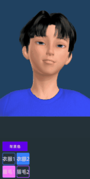
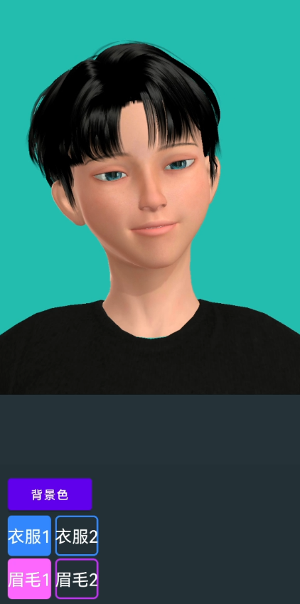
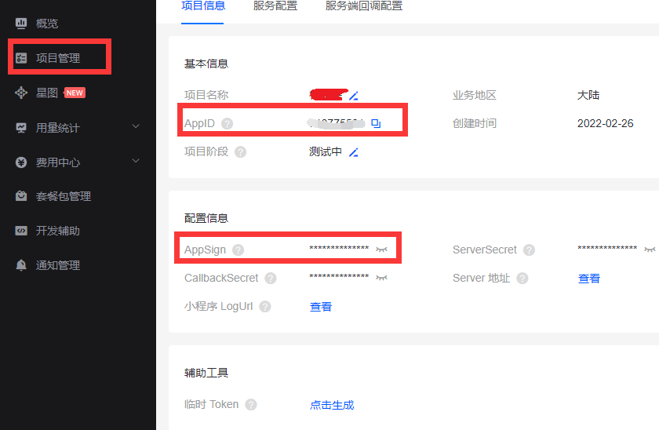
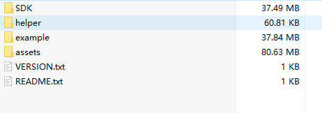
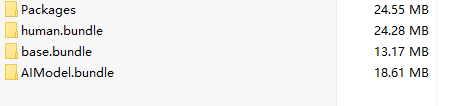
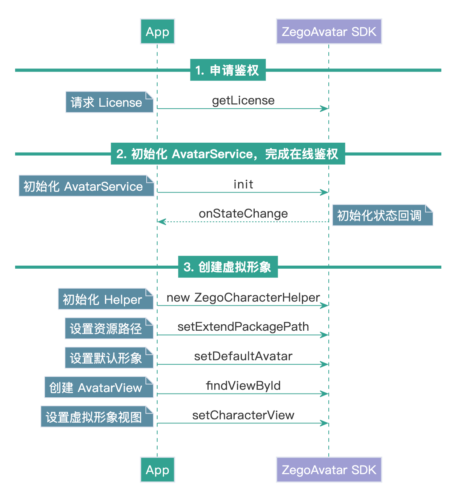
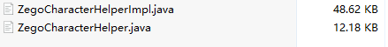

元宇宙（Metaverse），是人类运用数字技术构建的，由现实世界映射或超越现实世界，可与现实世界交互的虚拟世界，具备新型社会体系的数字生活空间。

可见元宇宙第一步是创建专属虚拟形象，但创建3D虚拟形象需要3D基础知识。对于大部分`android`开发者(包括我本人)来说没有这方面的积累。难道因此我们就难以进入元宇宙的世界吗？不，今天我们借助即构平台提供的[Avatar SDK](https://doc-zh.zego.im/article/15699)，只要有`Android`基础即可进入最火的元宇宙世界！先看效果：



上面gif被压缩的比较狠，这里放一张截图：




# 1 免费注册即构开发者
前往即构控制台网站：[https://console.zego.im/](https://console.zego.im/)注册开发者账户。注册成功后，创建项目：



控制台中可以得到AppID和AppSign两个数据，这两个数据是重要凭证，后面会用到。

由于我们用到了即构的`Avatar`功能，但目前官方没有提供线上自动开启方式，需要主动找客服申请（**当然，这是免费的**），只需提供自己项目的包名，即可开通Avatar权限。打开[https://doc-zh.zego.im/article/15206](https://doc-zh.zego.im/article/15206)右下角有`“联系我们”`，点击即可跟客服申请免费开通权限。

**注意，如果不向客服申请`Avatar`权限，调用`AvatarSDK`会失败！**

# 2 准备开发环境
前往即构官方元宇宙开发SDK网站[https://doc-zh.zego.im/article/15302](https://doc-zh.zego.im/article/15302)下载SDK，得到如下文件列表：



接下来过程如下：
1. 打开`SDK`目录，将里面的`ZegoAvatar.aar`拷贝至`app/libs`目录下。
2. 添加`SDK`引用。打开`app/build.gradle`文件，在`dependencies`节点引入 `libs`下所有的`jar`和`aar`:
```gradle

dependencies {
 
    implementation fileTree(dir: 'libs', include: ['*.jar', "*.aar"]) //通配引入
    
    //其他略
}
```
3. 设置权限。根据实际应用需要，设置应用所需权限。进入`app/src/main/AndroidManifest.xml` 文件，添加权限。

```xml
<uses-permission android:name="android.permission.RECORD_AUDIO" />
<uses-permission android:name="android.permission.INTERNET" />
<uses-permission android:name="android.permission.ACCESS_WIFI_STATE" />
<uses-permission android:name="android.permission.ACCESS_NETWORK_STATE" />
<uses-permission android:name="android.permission.CAMERA" />
<uses-permission android:name="android.permission.BLUETOOTH" />
<uses-permission android:name="android.permission.MODIFY_AUDIO_SETTINGS" />
<uses-permission android:name="android.permission.WRITE_EXTERNAL_STORAGE" />
<uses-permission android:name="android.permission.READ_EXTERNAL_STORAGE" />

<uses-feature
    android:glEsVersion="0x00020000"
    android:required="true" />
<uses-feature android:name="android.hardware.camera" />
<uses-feature android:name="android.hardware.camera.autofocus" />
```

> 因为`Android 6.0`在一些比较重要的权限上要求必须申请动态权限，不能只通过 `AndroidMainfest.xml`文件申请静态权限。具体动态请求权限代码可看附件源码。


# 3 导入资源
上一小节下载的`zip`文件中，有个`assets`目录。里面包含了`Avatar`形象相关资源，如：衣服、眉毛、鞋子等。这是即构官方免费提供的资源，可以满足一般性需求了。当然了，如果想要自己定制资源也是可以的。`assets`文件内容如下：



| 资源名称	| 说明	|
| -------  | ----- |
| AIModel.bundle |	Avatar 的 AI 模型资源。当使用表情随动、声音随动、AI 捏脸等能力时，必须先将该资源的绝对路径设置给 Avatar SDK。|	
| base.bundle	| 美术资源，包含基础 3D 人物模型资源、资源映射表、人物模型默认外形等。	|
| Packages	| 美妆、挂件、装饰等资源。	每个资源 200 KB ~ 1 MB 不等，跟资源复杂度相关。	|


> **注意：由于资源文件很大，上面下载的美术资源只包含少量必须资源。如果需要全部资源，可以去官网找客服索要：[https://doc-zh.zego.im/article/14882](https://doc-zh.zego.im/article/14882)**

上面的文件需要存放到`Android`本地`SDCard`上，这里有2个方案可供参考：
- 方案一： 将资源先放入到`app/src/assets`目录内，然后在app启动时，自动将assets的内容拷贝到`SDcard`中。
- 方案二： 将资源放入到服务器端，运行时自动从服务器端下载。

为了简单起见，我们这里采用方案一。参考代码如下, 详细代码可以看附件：
```java
AssetsFileTransfer.copyAssetsDir2Phone(this.getApplication(),
            "AIModel.bundle", "assets");
AssetsFileTransfer.copyAssetsDir2Phone(this.getApplication(),
            "base.bundle", "assets");
AssetsFileTransfer.copyAssetsDir2Phone(this.getApplication(),
            "Packages", "assets");
```

# 4 创建虚拟形象
创建虚拟形象本质上来说就是调用即构的`Avatar SDK`，其大致流程如下：


接下来我们逐步实现上面流程。

**需要注意的是，上面示意图中采用的是AvatarView，可以非常方便的直接展示Avatar形象，但是不方便后期将画面通过RTC实时传递， 因此，我们后面的具体实现视通过TextureView替代AvatarView。**

## 4.1 申请权鉴
这里再次强调一下，一定要打开[https://doc-zh.zego.im/article/15206](https://doc-zh.zego.im/article/15206)点击右下角有`“联系我们”`，向客服申请免费开通Avatar权限。否则无法使用`Avatar SDK`。

申请权鉴代码如下：
```java

public class KeyCenter { 
    // 控制台地址: https://console.zego.im/dashboard 
    public static long APP_ID = 这里值可以在控制台查询，参考第一节;  //这里填写APPID
    public static String APP_SIGN =  这里值可以在控制台查询，参考第一节; 
    // 鉴权服务器的地址
    public final static String BACKEND_API_URL = "https://aieffects-api.zego.im?Action=DescribeAvatarLicense";

    public static String avatarLicense = null;
    public static String getURL(String authInfo) {
        Uri.Builder builder = Uri.parse(BACKEND_API_URL).buildUpon();
        builder.appendQueryParameter("AppId", String.valueOf(APP_ID));
        builder.appendQueryParameter("AuthInfo", authInfo);

        return builder.build().toString();
    }

    public interface IGetLicenseCallback {
        void onGetLicense(int code, String message, ZegoLicense license);
    }

    /**
     * 在线拉取 license
     * @param context
     * @param callback
     */
    public static void getLicense(Context context, final IGetLicenseCallback callback) {
        requestLicense(ZegoAvatarService.getAuthInfo(APP_SIGN, context), callback);
    }

    /**
     * 获取license
     * */
    public static void requestLicense(String authInfo, final IGetLicenseCallback callback) {

        String url = getURL(authInfo);

        HttpRequest.asyncGet(url, ZegoLicense.class, (code, message, responseJsonBean) -> {
            if (callback != null) {
                callback.onGetLicense(code, message, responseJsonBean);
            }
        });
    }


    public class ZegoLicense {
        @SerializedName("License")
        private String license;
        public String getLicense() {
            return license;
        }
        public void setLicense(String license) {
            this.license = license;
        }
    }

}
```
在获取Lincense时，只需调用`getLicense`函数，例如在`Activity`类中只需如下调用：
```java
KeyCenter.getLicense(this, (code, message, response) -> {
        if (code == 0) {
            KeyCenter.avatarLicense = response.getLicense();
            showLoading("正在初始化...");
            avatarMngr = AvatarMngr.getInstance(getApplication());
            avatarMngr.setLicense(KeyCenter.avatarLicense, this);
        } else {
            toast("License 获取失败, code: " + code);
        }
    });
```

## 4.2 初始化AvatarService
初始化AvatarService过程比较漫长（可能要几秒），通过开启worker线程后台加载以避免主线程阻塞。因此我们定义一个回调函数，待完成初始化后回调通知：
```java

public interface OnAvatarServiceInitSucced {
    void onInitSucced();
}

public void setLicense(String license, OnAvatarServiceInitSucced listener) {
    this.listener = listener;
    ZegoAvatarService.addServiceObserver(this);
    String aiPath = FileUtils.getPhonePath(mApp, "AIModel.bundle", "assets"); //   AI 模型的绝对路径
    ZegoServiceConfig config = new ZegoServiceConfig(license, aiPath);
    ZegoAvatarService.init(mApp, config);
}

@Override
public void onStateChange(ZegoAvatarServiceState state) {
    if (state == ZegoAvatarServiceState.InitSucceed) {
        Log.i("ZegoAvatar", "Init success");
        // 要记得及时移除通知
        ZegoAvatarService.removeServiceObserver(this);
        if (listener != null) listener.onInitSucced();
    }
}
```
这里`setLicense`函数内完成初始化`AvatarService`，初始化完成后会回调onStateChange函数。但是要注意，在初始化之前必须把资源文件拷贝到本地SDCard，即完成资源导入：
```java
private void initRes(Application app) {
    // 先把资源拷贝到SD卡，注意：线上使用时，需要做一下判断，避免多次拷贝。资源也可以做成从网络下载。
    if (!FileUtils.checkFile(app, "AIModel.bundle", "assets"))
        FileUtils.copyAssetsDir2Phone(app, "AIModel.bundle", "assets");
    if (!FileUtils.checkFile(app, "base.bundle", "assets"))
        FileUtils.copyAssetsDir2Phone(app, "base.bundle", "assets");
    if (!FileUtils.checkFile(app, "human.bundle", "assets"))
        FileUtils.copyAssetsDir2Phone(app, "human.bundle", "assets");
    if (!FileUtils.checkFile(app, "Packages", "assets"))
        FileUtils.copyAssetsDir2Phone(app, "Packages", "assets");
}
```

## 4.3 创建虚拟形象
前面在[https://doc-zh.zego.im/article/15302](https://doc-zh.zego.im/article/15302)下载`SDK`包含了`helper`目录，这个目录里面有非常重要的两个文件：



其中`ZegoCharacterHelper`文件是个接口定义类，即虽然是个类，但具体的实现全部在`ZegoCharacterHelperImpl`中。我们先一睹为快，看看`ZegoCharacterHelper`包含了哪些可处理的属性:
```java
public class ZegoCharacterHelper {
    public static final String MODEL_ID_MALE = "male";
    public static final String MODEL_ID_FEMALE = "female";
    //****************************** 捏脸维度的 key 值 ******************************/
    public static final String FACESHAPE_BROW_SIZE_Y = "faceshape_brow_size_y";// 眉毛厚度, 取值范围0.0-1.0，默认值0.5
    public static final String FACESHAPE_BROW_SIZE_X = "faceshape_brow_size_x";// 眉毛长度, 取值范围0.0-1.0，默认值0.5
    public static final String FACESHAPE_BROW_ALL_Y = "faceshape_brow_all_y";// 眉毛高度, 取值范围0.0-1.0，默认值0.5
    public static final String FACESHAPE_BROW_ALL_ROLL_Z = "faceshape_brow_all_roll_z";// 眉毛旋转, 取值范围0.0-1.0，默认值0.5
    public static final String FACESHAPE_EYE_SIZE = "faceshape_eye_size"; // 眼睛大小, 取值范围0.0-1.0，默认值0.5
    public static final String FACESHAPE_EYE_SIZE_Y = "faceshape_eye_size_y";
    public static final String FACESHAPE_EYE_ROLL_Y = "faceshape_eye_roll_y";// 眼睛高度, 取值范围0.0-1.0，默认值0.5
    public static final String FACESHAPE_EYE_ROLL_Z = "faceshape_eye_roll_z";// 眼睛旋转, 取值范围0.0-1.0，默认值0.5
    public static final String FACESHAPE_EYE_X = "faceshape_eye_x";// 双眼眼距, 取值范围0.0-1.0，默认值0.5
    public static final String FACESHAPE_NOSE_ALL_X = "faceshape_nose_all_x";// 鼻子宽度, 取值范围0.0-1.0，默认值0.5
    public static final String FACESHAPE_NOSE_ALL_Y = "faceshape_nose_all_y";// 鼻子高度, 取值范围0.0-1.0，默认值0.5
    public static final String FACESHAPE_NOSE_SIZE_Z = "faceshape_nose_size_z";
    public static final String FACESHAPE_NOSE_ALL_ROLL_Y = "faceshape_nose_all_roll_y";// 鼻头旋转, 取值范围0.0-1.0，默认值0.5
    public static final String FACESHAPE_NOSTRIL_ROLL_Y = "faceshape_nostril_roll_y";// 鼻翼旋转, 取值范围0.0-1.0，默认值0.5
    public static final String FACESHAPE_NOSTRIL_X = "faceshape_nostril_x";
    public static final String FACESHAPE_MOUTH_ALL_Y = "faceshape_mouth_all_y";// 嘴巴上下, 取值范围0.0-1.0，默认值0.5
    public static final String FACESHAPE_LIP_ALL_SIZE_Y = "faceshape_lip_all_size_y";// 嘴唇厚度, 取值范围0.0-1.0，默认值0.5
    public static final String FACESHAPE_LIPCORNER_Y = "faceshape_lipcorner_y";// 嘴角旋转, 取值范围0.0-1.0，默认值0.5
    public static final String FACESHAPE_LIP_UPPER_SIZE_X = "faceshape_lip_upper_size_x"; // 上唇宽度, 取值范围0.0-1.0，默认值0.5
    public static final String FACESHAPE_LIP_LOWER_SIZE_X = "faceshape_lip_lower_size_x"; // 下唇宽度, 取值范围0.0-1.0，默认值0.5
    public static final String FACESHAPE_JAW_ALL_SIZE_X = "faceshape_jaw_all_size_x";// 下巴宽度, 取值范围0.0-1.0，默认值0.5
    public static final String FACESHAPE_JAW_Y = "faceshape_jaw_y";// 下巴高度, 取值范围0.0-1.0，默认值0.5
    public static final String FACESHAPE_CHEEK_ALL_SIZE_X = "faceshape_cheek_all_size_x";// 脸颊宽度, 取值范围0.0-1.0，默认值0.5

    //其他函数略
}
```

可以看到，上面数据基本包含所有人脸属性了，基本具备了捏脸能力，篇幅原因，我们这里不具体去实现。有这方面需求的读者，可以通过在界面上调整上面相关属性来实现。


接下来我们开始创建虚拟形象，首先创建一个User实体类：
```java

public class User {
    public String userName; //用户名
    public String userId; //用户ID
    public boolean isMan; //性别
    public int width; //预览宽度
    public int height; //预览高度
    public int bgColor; //背景颜色
    public int shirtIdx = 0; // T-shirt资源id
    public int browIdx = 0; //眉毛资源id

    public User(String userName, String userId, int width, int height) {
        this.userName = userName;
        this.userId = userId;
        this.width = width;
        this.height = height;
        this.isMan = true;
        bgColor = Color.argb(255, 33, 66, 99);
    }  
}
```
示例作用，为了简单起见，我们这里只针对眉毛和衣服资源做选取。接下来创建一个Activity：

```java
public class AvatarActivity extends BaseActivity  {
    private int vWidth = 720;
    private int vHeight = 1080; 
    private User user = new User("C_0001", "C_0001", vWidth, vHeight);
    private TextureView mTextureView;  //用于显示Avatar形象
    private AvatarMngr mAvatarMngr; // 用于维护管理Avatar
    private ColorPickerDialog colorPickerDialog; //用于背景色选取

    @Override
    protected void onCreate(Bundle savedInstanceState) {
        super.onCreate(savedInstanceState);
        setContentView(R.layout.activity_avatar);
        
        // ....
        // 其他初始化界面相关代码略...
        // ....

        user.isMan = true;
        mTextureView = findViewById(R.id.avatar_view);  
        mZegoMngr = ZegoMngr.getInstance(getApplication()); 
        // 开启虚拟形象预览
        mAvatarMngr.start(mTextureView, user);
    }
```
最后一行代码中开启了虚拟形象预览，那么这里开启虚拟形象预览具体做了哪些工作呢？show me the code:
```java
public class AvatarMngr implements ZegoAvatarServiceDelegate, RTCMngr.CaptureListener {
    private static final String TAG = "AvatarMngr";
    private static AvatarMngr mInstance;
    private boolean mIsStop = false;

    private User mUser = null;
    private TextureBgRender mBgRender = null;
    private OnAvatarServiceInitSucced listener;
    private ZegoCharacterHelper mCharacterHelper;
    private Application mApp;

    public interface OnAvatarServiceInitSucced {
        void onInitSucced();
    }

    public void setLicense(String license, OnAvatarServiceInitSucced listener) {
        this.listener = listener;
        ZegoAvatarService.addServiceObserver(this);
        String aiPath = FileUtils.getPhonePath(mApp, "AIModel.bundle", "assets"); //   AI 模型的绝对路径
        ZegoServiceConfig config = new ZegoServiceConfig(license, aiPath);
        ZegoAvatarService.init(mApp, config);
    }

    public void stop() {
        mIsStop = true;
        mUser = null;
        stopExpression();
    }

    public void updateUser(User user) {
        mUser = user;
        if (user.shirtIdx == 0) {
            mCharacterHelper.setPackage("m-shirt01");
        } else {
            mCharacterHelper.setPackage("m-shirt02");
        }
        if (user.browIdx == 0) {
            mCharacterHelper.setPackage("brows_1");
        } else {
            mCharacterHelper.setPackage("brows_2");
        }
    }

    /**
     * 启动Avatar，调用此函数之前，请确保已经调用过setLicense
     *
     * @param avatarView
     */
    public void start(TextureView avatarView, User user) {
        mUser = user;
        mIsStop = false;
        initAvatar(avatarView, user);
        startExpression();
    }

    private void initAvatar(TextureView avatarView, User user) {
        String sex = ZegoCharacterHelper.MODEL_ID_MALE;
        if (!user.isMan) sex = ZegoCharacterHelper.MODEL_ID_FEMALE;

        // 创建 helper 简化调用
        // base.bundle 是头模, human.bundle 是全身人模
        mCharacterHelper = new ZegoCharacterHelper(FileUtils.getPhonePath(mApp, "human.bundle", "assets"));
        mCharacterHelper.setExtendPackagePath(FileUtils.getPhonePath(mApp, "Packages", "assets"));
        // 设置形象配置
        mCharacterHelper.setDefaultAvatar(sex);
        updateUser(user);
        // 获取当前妆容数据, 可以保存到用户资料中
        String json = mCharacterHelper.getAvatarJson();

    }

    // 启动表情检测
    private void startExpression() {
        // 启动表情检测前要申请摄像头权限, 这里是在 MainActivity 已经申请过了
        ZegoAvatarService.getInteractEngine().startDetectExpression(ZegoExpressionDetectMode.Camera, expression -> {
            // 表情直接塞给 avatar 驱动
            mCharacterHelper.setExpression(expression);
        });
    }

    // 停止表情检测
    private void stopExpression() {
        // 不用的时候记得停止
        ZegoAvatarService.getInteractEngine().stopDetectExpression();
    }

    // 获取到 avatar 纹理后的处理
    public void onCaptureAvatar(int textureId, int width, int height) {
        if (mIsStop || mUser == null) { // rtc 的 onStop 是异步的, 可能activity已经运行到onStop了, rtc还没
            return;
        }
        boolean useFBO = true;
        if (mBgRender == null) {
            mBgRender = new TextureBgRender(textureId, useFBO, width, height, Texture2dProgram.ProgramType.TEXTURE_2D_BG);
        }
        mBgRender.setInputTexture(textureId);
        float r = Color.red(mUser.bgColor) / 255f;
        float g = Color.green(mUser.bgColor) / 255f;
        float b = Color.blue(mUser.bgColor) / 255f;
        float a = Color.alpha(mUser.bgColor) / 255f;
        mBgRender.setBgColor(r, g, b, a);
        mBgRender.draw(useFBO); // 画到 fbo 上需要反向的
        ZegoExpressEngine.getEngine().sendCustomVideoCaptureTextureData(mBgRender.getOutputTextureID(), width, height, System.currentTimeMillis());


    }

    @Override
    public void onStartCapture() {
        if (mUser == null) return;
//        // 收到回调后，开发者需要执行启动视频采集相关的业务逻辑，例如开启摄像头等
        AvatarCaptureConfig config = new AvatarCaptureConfig(mUser.width, mUser.height);
//        // 开始捕获纹理
        mCharacterHelper.startCaptureAvatar(config, this::onCaptureAvatar);
    }

    @Override
    public void onStopCapture() {
        mCharacterHelper.stopCaptureAvatar();
        stopExpression();
    }


    private void initRes(Application app) {
        // 先把资源拷贝到SD卡，注意：线上使用时，需要做一下判断，避免多次拷贝。资源也可以做成从网络下载。
        if (!FileUtils.checkFile(app, "AIModel.bundle", "assets"))
            FileUtils.copyAssetsDir2Phone(app, "AIModel.bundle", "assets");
        if (!FileUtils.checkFile(app, "base.bundle", "assets"))
            FileUtils.copyAssetsDir2Phone(app, "base.bundle", "assets");
        if (!FileUtils.checkFile(app, "human.bundle", "assets"))
            FileUtils.copyAssetsDir2Phone(app, "human.bundle", "assets");
        if (!FileUtils.checkFile(app, "Packages", "assets"))
            FileUtils.copyAssetsDir2Phone(app, "Packages", "assets");

    }

    @Override
    public void onError(ZegoAvatarErrorCode code, String desc) {
        Log.e(TAG, "errorcode : " + code.getErrorCode() + ",desc : " + desc);
    }

    @Override
    public void onStateChange(ZegoAvatarServiceState state) {
        if (state == ZegoAvatarServiceState.InitSucceed) {
            Log.i("ZegoAvatar", "Init success");
            // 要记得及时移除通知
            ZegoAvatarService.removeServiceObserver(this);
            if (listener != null) listener.onInitSucced();
        }
    }

    private AvatarMngr(Application app) {
        mApp = app;
        initRes(app);
    }

    public static AvatarMngr getInstance(Application app) {
        if (null == mInstance) {
            synchronized (AvatarMngr.class) {
                if (null == mInstance) {
                    mInstance = new AvatarMngr(app);
                }
            }
        }
        return mInstance;
    }
}

```

以上代码完成了整个虚拟形象的创建，关键代码全部展示，如果还需要具体全部代码，直接从附件中下载即可。

# 5 附件

- 源码：http://xxx.xxx.xxx.xxx
- 即构元宇宙官网：[https://doc-zh.zego.im/article/15302](https://doc-zh.zego.im/article/15302)